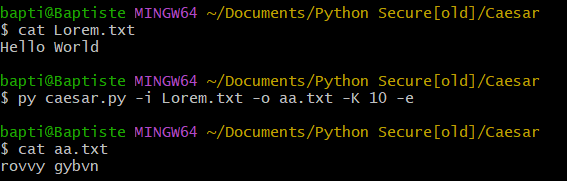
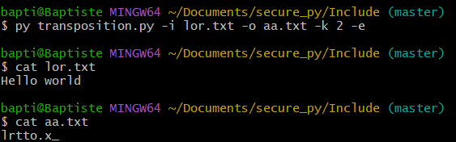
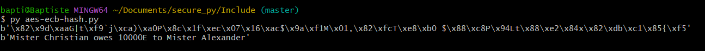
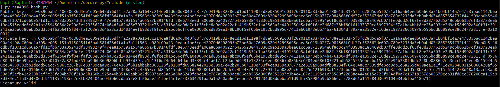
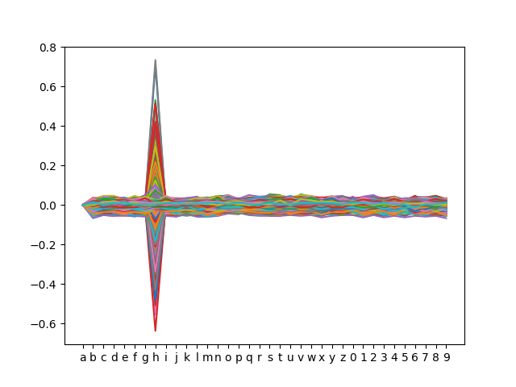
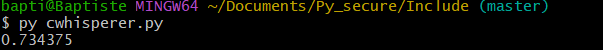
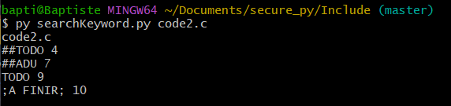
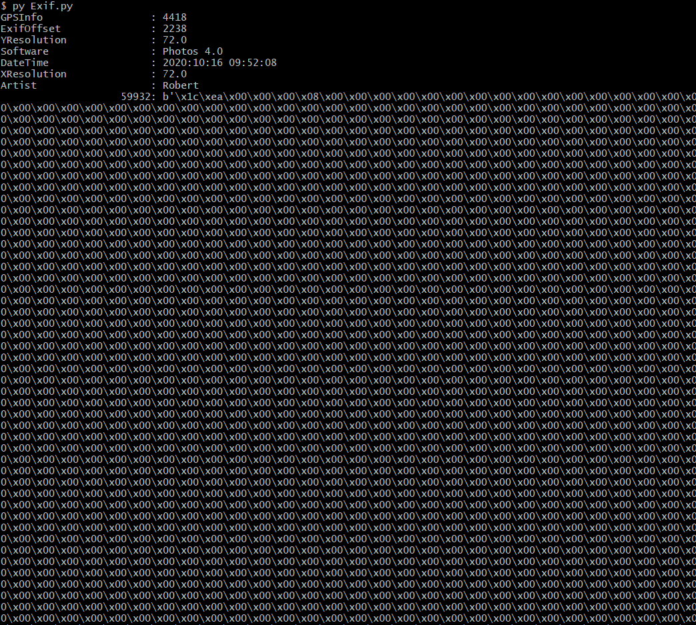
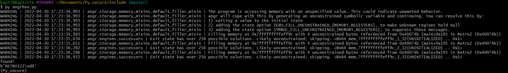
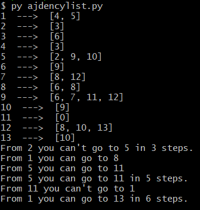

# Rapport python for Security
## Baptiste BOIDRON
*** 
## 1. César  
On peut voir que le script prend en argument un fichier d'entrée une clé et un fichier de sortie ainsi que le mode (encrypter ou décrypter). Suite à ça il retourne un fichier texte contenant le fichier d'entrée crypter ou décrypter suivant le mode choisi 

```
import argparse
import string
import json

parser = argparse.ArgumentParser(description="Crypter en suivant le chiffrement de césar")
groupe = parser
groupe.add_argument("-i", "--input", type=str, help="Fichier d'entrée")
groupe.add_argument("-o", "--output", type=str, help="Fichier de sortie")
groupe.add_argument("-w", "--dictionnaire", type=str, help="Dictionnaire")
groupe.add_argument("-K", "--Key", type=int, help="Pas")
groupe.add_argument("-e", "--encrypt", action="store_true", help="encrypt")
groupe.add_argument("-d", "--decrypt", action="store_true", help="decrypt")
args = parser.parse_args()

if not args.input:
    print("Veuillez indiquer un fichier d'entrée")

if not args.output:
    print("Veuillez indiquer un fichier de sortie")


def caesar(plaintext, shift):
    alphabet = string.ascii_lowercase
    shifted_alphabet = alphabet[shift:] + alphabet[:shift]
    table = str.maketrans(alphabet, shifted_alphabet)
    return plaintext.translate(table)


if args.encrypt is True:
    entree = open(args.input, mode="r")      # Lit le fichier d'entrée
    texte = entree.read().lower()            # Met tout le texte en minuscule
    entree.close()
    cle = args.Key % 26                      # Modulo 26 pour pouvoir entrer des décalages > 26 
    encrypter = caesar(texte, cle)
    sortie = open(args.output, mode="w")
    cipher = sortie.write(encrypter)
    sortie.close()

elif args.decrypt is True:
    entree = open(args.input, mode="r")
    texte = entree.read().lower()
    entree.close()
    for i in range(0, 26):
        encrypter = caesar(texte, i)
        encrypter_list = encrypter.split()
        sortie = open(args.output, mode="a")
        cipher = sortie.write(encrypter + "\n \n")
    sortie.close()

```


#### - Utilisation sur un fichier à crypter

{height=55%}

#### - Utilisation sur un fichier à décrypter

```
rovvy gybvn
spwwz hzcwo
tqxxa iadxp
uryyb jbeyq
vszzc kcfzr
wtaad ldgas
xubbe mehbt
yvccf nficu
zwddg ogjdv
axeeh phkew
byffi qilfx
czggj rjmgy
dahhk sknhz
ebiil tloia
fcjjm umpjb
gdkkn vnqkc
hello world         #Ici on voit apparaître le message décrypté
ifmmp xpsme
jgnnq yqtnf
khoor zruog
lipps asvph
mjqqt btwqi
nkrru cuxrj
olssv dvysk
pmttw ewztl
qnuux fxaum

```

***
## 2. Chiffrement mono alphabétique  

Le script utilise un fichier dictionnaire au format json pour repérer des mots qu'il connaît et lui permettre de réaliser une analyse fréquentielle des lettres.
```
import argparse
import string

parser = argparse.ArgumentParser(
    description="Caesar module for ciphering and decyphering")
parser.add_argument("-i", "--input", type=str,
                    help="Input File (path of plaintext in encrypt mode or cypher in decrypt mode")
parser.add_argument("-o", "--output", type=str,
                    help="Output File (how you want your output file to be named)")
parser.add_argument("-k", "--alphabet", type=str,
                    help="The alphabet you want to use for encryption")

group = parser.add_mutually_exclusive_group()
group.add_argument("-e", "--encryption",
                   action="store_true", help="Encryption mode")
group.add_argument("-d", "--decryption",
                   action="store_true", help="Decryption mode")
args = parser.parse_args()

alphabet = string.ascii_lowercase

with open(args.input, mode='r') as inputFile:
    message = inputFile.read()
inputFile.close()


def dictCiphering(alpha1, alpha2):
    cipherDict = {}
    for i in range(len(alphabet)):
        cipherDict[alpha1[i]] = alpha2[i]
    return cipherDict


def encryption(message, cipherDict):
    result = []
    for letter in message:
        if(letter.isupper()):
            for i in cipherDict.keys():
                if letter.lower() == i:
                    result.append(cipherDict.get(i).upper())
        elif(letter.islower()):
            for i in cipherDict.keys():
                if letter == i:
                    result.append(cipherDict.get(i).lower())
        else:
            result.append(letter)
    print(''.join(result))
    return ''.join(result)


def decryption(message):
    newDict = {}
    textFreq = {}
    alphaFreq = {'a': 7.3, 'b': 2, 'c': 4, 'd': 3.8, 'e': 11, 'f': 1.4, 'g': 3, 'h': 2.3, 'i': 8.6, 'j': 0.21, 'k': 0.97, 'l': 5.30, 'm': 2.7,
                 'n': 7.2, 'o': 6.1, 'p': 2.8, 'q': 0.19, 'r': 7.3, 's': 8.7, 't': 6.7, 'u': 3.3, 'v': 1, 'w': 0.91, 'x': 0.27, 'y': 1.6, 'z': 0.44}
    result = {i: message.lower().count(i) for i in alphabet}
    for letter, occurency in result.items():
        textFreq[letter] = round(occurency * 100.0 / sum(result.values()), 2)
    print(textFreq)
    for i in range(len(alphabet)):
        aFreqMax = max(alphaFreq, key=alphaFreq.get)
        tFreqMax = max(textFreq, key=textFreq.get)
        newDict[aFreqMax] = tFreqMax
        alphaFreq[aFreqMax] = -i-1
        textFreq[tFreqMax] = -i-1
    print(textFreq)
    return newDict


if args.encryption:
    tempDict = dictCiphering(alphabet, args.alphabet)
    with open(args.output, mode='w') as myFile:
        myFile.write(encryption(message, tempDict))
    myFile.close()

elif args.decryption:
    tempDict = decryption(message)
    print(tempDict)
    with open(args.output, mode='w') as myFile:
        encryption(message, tempDict)
    myFile.close()
else:
    print("Please choose -e or -d")

```  

#### - Utilisation du script pour crypter et décrypter  


*** 
## 3. Poly alphabétique

```
import argparse
import string
import random
import matplotlib.pyplot as plt

parser = argparse.ArgumentParser(description="Caesar module for ciphering and decyphering")
parser.add_argument("-i", "--input", type=str, help="Input File (path of plaintext in encrypt mode or cypher in decrypt mode")
parser.add_argument("-o", "--output", type=str, help="Output File (how you want your output file to be named)")
parser.add_argument("-k", "--numtables", type=int, help="The alphabet you want to use for encryption")
group = parser.add_mutually_exclusive_group()
group.add_argument("-e", "--encryption",action="store_true", help="Encryption mode")
group.add_argument("-c", "--crack",action="store_true", help="Crack mode")
args = parser.parse_args()

alphabet = string.ascii_lowercase
samecharacters = string.digits + string.punctuation + string.whitespace

with open(args.input, mode='r') as inputFile:
    message = inputFile.read()
inputFile.close()       

def alphaCreate(step):
    listAlpha = []
    for i in range(int(step)):
        listAlpha.append(''.join(random.sample(alphabet,len(alphabet))))
    return listAlpha

def dictListCiphering(alpha1, listAlpha):
    dictList =[]
    for i in range(len(listAlpha)):
        cipherDict = dict()
        for j in range(len(alphabet)):
            cipherDict[alpha1[j]] = listAlpha[i][j]
        dictList.append(cipherDict)
    return dictList

def encryption(text, dictList):
    result = ""
    step=0
    for letter in text:
        cipherDict = dictList[step]
        if(letter.isupper()):
            for i in cipherDict.keys():
                if letter.lower() == i:
                    result += cipherDict.get(i).upper()
                    if step >= len(dictList)-1:
                        step = 0
                    else:
                        step += 1
        elif(letter.islower()):
            for i in cipherDict.keys():
                if letter == i:
                    result += cipherDict.get(i).lower()
                    if step >= len(dictList)-1:
                        step = 0
                    else:
                        step += 1
        else:
            result += letter
    print(result)
    return result

def cracking(text):
    result = []
    stepList = []
    textsFreq = dict()
    final = []
    for step in range(2, 10):
        templist= []
        for i in range(0, len(text), step):
            if(text[i].lower().islower()):
                templist.append(text[i].lower())
        stepList.append(templist)
    for i in range(len(stepList)):
        result.append({j:''.join(stepList[i]).count(j) for j in string.ascii_lowercase})
    for i in range(len(result)):
        textFreq = dict()
        for letter, occurency in result[i].items():
            textFreq[letter] = round(occurency * 100.0 / sum(result[i].values()), 2)
        tempChar = "Step #%s" % (i+2)
        textsFreq[tempChar] = textFreq
    for freq in textsFreq.values():
        final.append(max(freq.values()))
    return final

if args.encryption:
    dictList = dictListCiphering(alphabet, alphaCreate(args.numtables))
    with open(args.output, mode='w') as myFile:
        myFile.write(encryption(message, dictList))
    myFile.close() 
elif args.crack:
    with open(args.output, mode='w') as myFile:
        yaxis = cracking(message)
        print(yaxis)
    myFile.close()
    plt.plot(range(1,9), yaxis)
    plt.xlabel("step")
    plt.ylabel("max frequency")
    plt.show()
else:
    print("Please choose -e or -d")
```

#### - Utilisation du script pour crypter et décrypter 


***
## 4. One time padding
```
import argparse
import random

parser = argparse.ArgumentParser(description="Caesar module for ciphering and decyphering")
parser.add_argument("-i", "--input", type=str, help="Input File (path of plaintext in encrypt mode or cypher in decrypt mode")
parser.add_argument("-o", "--output", type=str, help="Output File (how you want your output file to be named)")
parser.add_argument("-k", "--keyfn", type=str, help="The filename of the key")
group = parser.add_mutually_exclusive_group()
group.add_argument("-e", "--encryption",action="store_true", help="Encryption mode")
group.add_argument("-d", "--decryption",action="store_true", help="Decryption mode")
args = parser.parse_args()

with open(args.input, mode='r') as inputFile:
    message = inputFile.read()
inputFile.close()       

def key_generation(message):
    text = []    
    for letter in message:
        text.append(ord(letter))
    key_stream = [random.randint(0,15) for i in range(len(text))]
    return text, key_stream

def encryption(message, key):
    return bytes([key[i] ^ message[i] for i in range(len(message))])

def decryption(message, key):
    return bytes([key[i] ^ message[i] for i in range(len(message))])

if args.encryption:
    message, key = key_generation(message)
    with open(args.output, mode='wb') as myFile:
        myFile.write(encryption(message, key))
    myFile.close() 
    with open(args.keyfn, mode='w') as keyFile:
        print(key)
        keyFile.write(''.join(str(i) for i in key))
    keyFile.close() 
elif args.decryption:
    with open(args.output, mode='wb') as myFile:
        myFile.write(decryption(message, key))
    myFile.close()

else:
    print("Please choose -e or -d")
```
***
## 5. Transposition
```
import argparse
import numpy as np

parser = argparse.ArgumentParser(description="Caesar module for ciphering and decyphering")
parser.add_argument("-i", "--input", type=str, help="Input File (path of plaintext in encrypt mode or cypher in decrypt mode")
parser.add_argument("-o", "--output", type=str, help="Output File (how you want your output file to be named)")
parser.add_argument("-k", "--columns", type=int, help="Number of columns")
group = parser.add_mutually_exclusive_group()
group.add_argument("-e", "--encryption",action="store_true", help="Encryption mode")
group.add_argument("-d", "--decryption",action="store_true", help="Decryption mode")
args = parser.parse_args()

with open(args.input, mode='r') as inputFile:
    message = inputFile.read()
inputFile.close()

message =("Bonjour ceci est mon message top-secret")
def create_arr(message, columns):
    result= np.array([message[i] for i in range(columns)])
    for i in range(columns, len(message), columns):  
        newrow = []
        try:
            for k in range(i,i+columns):
                if message[k] == ' ':
                    newrow.append('_') 
                else:
                    newrow.append(message[k])  
        except IndexError:
            newrow.append('_')
        result = np.vstack([result, newrow])
    return result
    
def encryption(message):
    final_str = ""
    result = np.transpose(message)
    for i in range(len(result)):
        for letter in result[i]:
            final_str += letter
    return final_str
    
if args.encryption:
    array = create_arr(args.input, args.columns)
    with open(args.output, mode='w') as myFile:
        myFile.write(encryption(array))
    myFile.close() 
else:
    print("Please choose -e or -d")
```
#### - Utilisation du script pour crypter

***
## 6. AES-ECB
```
from Crypto.Cipher import AES

def encryptAES(data, key):
    cipher = AES.new(key, AES.MODE_ECB)
    ciphertext = cipher.encrypt(data)
    return ciphertext

def decryptAES(data, key):
    cipher = AES.new(key, AES.MODE_ECB)
    result = cipher.decrypt(data)
    return result

data = b"Mister Christian owes 10000E to Mister Alexander"
key = b"1234567891234567"
ciphertext = encryptAES(data, key)
print(ciphertext)
print(decryptAES(ciphertext, key))

```
#### - Utilisation du script pour crypter et décrypter  

***
## 7. RSA
```
from Crypto.Hash import SHA256
from Crypto.PublicKey import RSA
from Crypto.Signature import pkcs1_15

def encrypt(message):
	data = SHA256.new()
	data.update(message)
	return data

def signThis(data):
	key = RSA.generate(4096)
	print(f"Public key:  (n={hex(key.n)}, e={hex(key.e)})")
	print(f"Private key: (n={hex(key.n)}, d={hex(key.d)})")
	sign = pkcs1_15.new(key).sign(data)
	return sign, key

def verifySign(data, sign, key):
	try:
		pkcs1_15.new(key).verify(data, sign)
		print("Signature valid")
	except(ValueError, TypeError):
		print("Invalid signature") 

message = b'This message is from me, I promise'
encMsg = encrypt(message)
signature, key = signThis(encMsg)
verifySign(encMsg, signature, key)

```
#### - Utilisation du script pour crypter et décrypter  

***
## 8. Chipwhisperer
```
import chipwhisperer as cw
import time
import subprocess
from matplotlib.cbook import maxdict
import tqdm
import numpy as np
import matplotlib.pylab as plt

# "test_projects/test_template_project.cwp" #si option == 0 indiquer un chemin pour le fichier des traces
path = "Include/spa_project.cwp"

##################################################
# Useful Functions
##################################################

# Get a random color
LIST_OF_VALID_CHARACTERS = ['a', 'b', 'c', 'd', 'e', 'f', 'g', 'h', 'i', 'j', 'k', 'l', 'm', 'n', 'o',
                            'p', 'q', 'r', 's', 't', 'u', 'v', 'w', 'x', 'y', 'z', '0', '1', '2', '3', '4', '5', '6', '7', '8', '9']


def rdm_color():
    return plt.cm.gist_ncar(np.random.random())


##################################################
# Send a password and capture trace
##################################################
proj = cw.open_project(path)


# 1- Show all traces on a same chart
# The code below only plot one trace. You must adapt.

def alltrace():
    for trace in proj.traces:
        print(trace.key)
        plt.plot(proj.traces[0].wave, color=rdm_color())
        print("Key of the wave : {0}".format(proj.traces[0].key))
    plt.show()

# 2 - Show difference traces


def difftrace():
    tableau = []
    for trace in range(len(proj.traces)):
        tableau += [proj.traces[trace].wave - proj.traces[0].wave]
    plt.plot(LIST_OF_VALID_CHARACTERS, tableau)
    plt.show()
    return (tableau)

# 3 - Find the max value and get the first letter of the password


def maximum():
    max_tab = []
    max_tab = max(difftrace(), key=max)
    print(max(max_tab))


maximum()

```
#### - Utilisation du script


***
## 9. Chercher un mot clé
```
import sys
import argparse
import string

input = sys.argv[1]

word = "TODO"
word2 = "ADU"
word3 = "A FINIR"
word4 = "PRAGMA"
ligne = 1
print(input)
with open(input) as f:
    for i in f.read().split('\n'):
        ligne = ligne + 1
        if i.find(word) != -1:
            print(i, ligne)
        elif i.find(word2) != -1:
            print(i, ligne)
        elif i.find(word3) != -1:
            print(i, ligne)
        elif i.find(word3) != -1:
            print(i, ligne)

```
#### - Utilisation du script

***
## 10. Exif
```
from PIL import Image
from PIL.ExifTags import TAGS

image = Image.open("Include\Source\EXO6-EXIF\landscape_02.jpg")

exifdata = image.getexif()

for tagid in exifdata:

    tagname = TAGS.get(tagid, tagid)

    value = exifdata.get(tagid)

    print(f"{tagname:25}: {value}")
```
##### Utilisation du script

***
## 11.Angr
```
import angr

proj = angr.Project("Include/Retro2")
proj.loader
addr_main = proj.loader.find_symbol("main").rebased_addr
addr_target = addr_main + 394
state = proj.factory.entry_state(addr=addr_main)
sm = proj.factory.simulation_manager(state)
sm.explore(find=addr_target)

while len(sm.found) == 0:
    sm.step()

if len(sm.found) > 0:
    print("found!")
    found_input = sm.found[0].posix.dumps(0)
    print(found_input)

```
#### - Utilisation du script
Ici on a bien récupéré le mot de passe du fichier  


***
## 12. Adjacency Matrices
```
# adjencymatrix.py
import numpy as np

adjencyList = {1: [4, 5],
    2: [3],
    3: [6],
    4: [3],
    5: [2,9,10],
    6: [9],
    7: [8,12],
    8: [6,8],
    9: [6,7,11,12],
    10: [9],
    11: [0],
    12: [8,10,13],
    13: [10]}

def graph(adjList):
    for node in adjList:
        print(node, " ---> ", [i for i in adjList[node]])
        
def createMatrix(adjList):
    adjMatrix = []
    tempMatrix = [0] * len(adjList)
    for sets in adjList.values():
        tempMatrix = [0] * len(adjList)
        for i in sets:
            tempMatrix[i-1] = 1
        adjMatrix.append(tempMatrix)
    return np.array(adjMatrix)

def links(adjMatrix, start, endpoint, steps=-1):
    sumOfPoweredMatrix = adjMatrix
    k=0
    n=0
    if steps ==-1:
        for i in range(2,len(adjMatrix)):
            sumOfPoweredMatrix = np.add(sumOfPoweredMatrix, np.linalg.matrix_power(adjMatrix, i))
        for rows in sumOfPoweredMatrix:
            k += 1
            if start == k:
                for element in rows:
                    n += 1
                    if n == endpoint:
                        if element >= 1:
                            
                            print("From", start, "you can go to", endpoint)
                        else:
                            print("From", start, "you can't go to", endpoint)

    else:
        poweredMatrix = np.linalg.matrix_power(adjMatrix, steps)
        k=0
        n=0
        for rows in poweredMatrix:
            k += 1
            if start == k:
                for element in rows:
                    n += 1
                    if n == endpoint:
                        if element >= 1:
                            
                            print("From", start, "you can go to", endpoint, "in", steps, "steps.")
                        else:
                            print("From", start, "you can't go to", endpoint, "in", steps, "steps.")

graph(adjencyList)
adjencyMatrix = createMatrix(adjencyList)
links(adjencyMatrix, 2, 5, 3)
links(adjencyMatrix, 1, 8)
links(adjencyMatrix, 5, 11)
links(adjencyMatrix, 5, 11, 5)
links(adjencyMatrix, 11, 1)
links(adjencyMatrix, 1, 13, 6)
```
#### - Utilisation du script

***